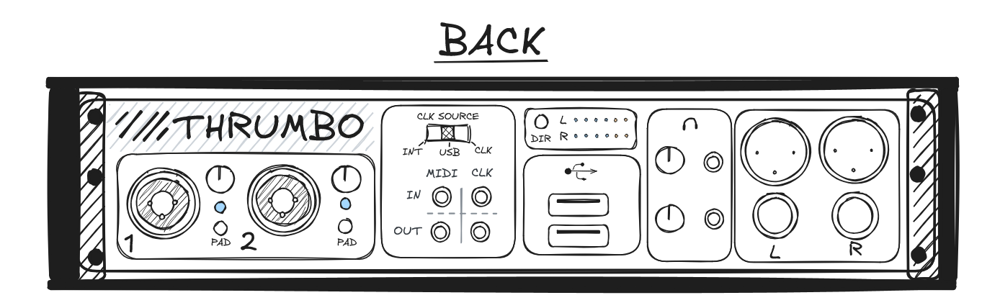
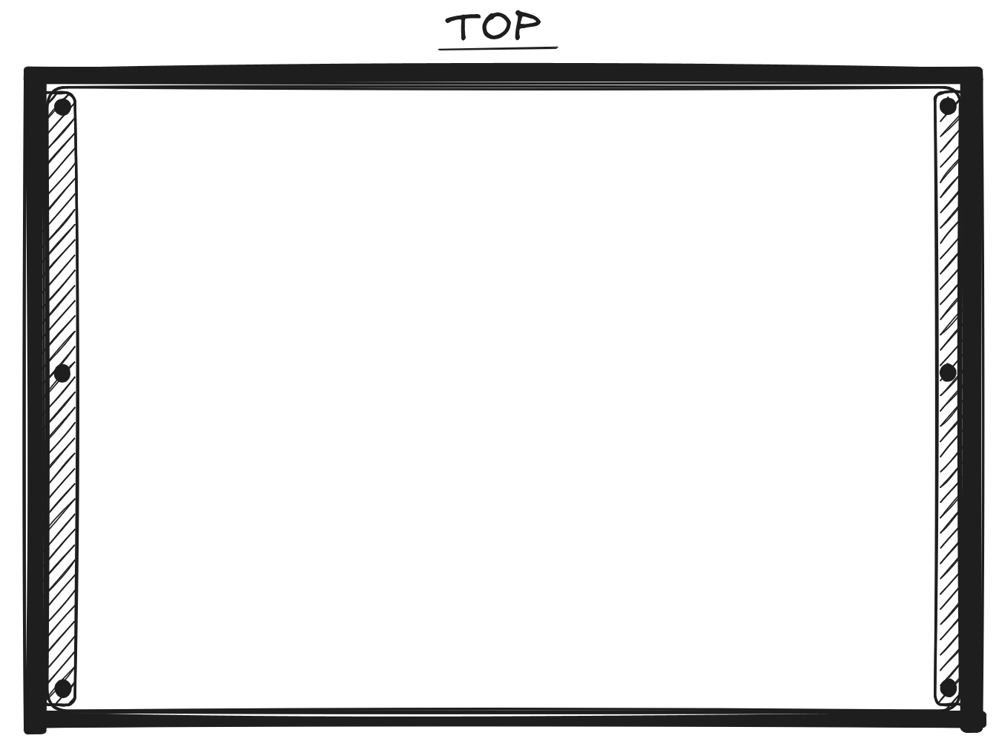

# October 2: Ideation

Hello forgers! Been super duper busy with life and stuff, and haven't been able to make anything for months and I'm itching to get into making something (I promise i'll do some reviews soon :|)

## Aim
The idea behind this project is to solve a longstanding Issue I've had when performing live as an electronic act (digital raccoon). We often need to take a very large setup, basically my laptop, an interface, 2 launchpads, my synth, a drum machine, all the cables and a table to dump everything on. All of this results in a pretty long setup and stuff tends to go wrong a lot (especially given my really stupid ableton setup with all the screwy windows audio driver shenanigans: I've got it half running on linux now which is way better but still not reliable enough for live). 

So for this project, I want to eliminate my laptop from the setup entirely and create a little box which I put my synth in, with audio output, running some software comparable to ableton and with adequate configurability to map midi controllers and perform pretty much as I do now, just without all the setup. 

My guitarist in my other band recently got a proper pedalboard with a built in power supply and I'm quite jealous, literally just plugs in one iec cable and the whole thing works, nothing else needed :) Thats what my ideal experience would be. 

## Actual design
Because I want this to not be ridiculously complicated, I'm going to limit the scope of this slightly. I don't need actual virtual instruments to run, so there won't need to be a ridiculous amount of processing power. I'm tentatively going to target a pi 5 4Gb, as I have a spare one on hand.

In terms of what I actually want from this, I'll make a list of design requirements and explain my reasoning afterwards.

### Design Requirements
- Stereo audio output - 1/4" + XLR - 16 bit, 48kHz
- Midi clock input + output (3.5mm)
- Midi input + output (3.5mm)
- At least 2 audio inputs (preferably hybrid jack)
- Headphone out (dual if possible)
- USB port
- Ability to act as access point (for ssh)
- At least 16 track audio playback
- 2x assignable outputs (cv, gate, other software defined)
- <5ms latency with no dropout
- Fits in a road case with a place for synth (custom built or bought)
- Support for LV2 plugins + Maybe vst via compat layer
- Support for Jack + ALSA
- Support for recording and playing back audio + midi clips
- Support for basic sampler + maybe software instruments
- Support for track mixing (level, pan, aux sends, busses, etc)
- In built hardware interface for clip launching
- Status display
- Display for editing (not too picky, probs b&w lcd)
- General purpose midi triggers + knobs
---

Starting with the inputs, I think some of it is fairly obvious. I want midi sync just to be able to connect to other hardware, I find that 3.5mm is used much more commonly than 5 pin din, and I have plenty of adapters anyway. 

Audio inputs are also quite important, 2 is probably all I'd need but more inputs is always good. Hybrid jacks are good for microphones, but not a necessity. They do add a bit of bulk.

Dual headphone it is just nice to have, I could absolutely live with a single one but I'd just end up using a headphone splitter anyway, so may as well wire it up inside of the case and remove the extra hardware. I don't need two seperate audio outputs, but if I end up having spares, may as well you know?

Single usb port is fine as I already have usb hubs and usb ports are kinda pricey for some reason. This would likely just be used for midi controllers.

The assignable outputs are pretty much just a little bonus feature if I have the time, money, and energy to do so. They probably wouldn't be actual audio outputs, just communicate from the pi to a rp2040 or something on a hat.

In terms of the software, I went with requirements that should fit what I currently do with ableton. I do use a lot of virtual instruments but these can easily be converted to simple samplers which is probably a better way to run it anyway.

For the actual control surfaces, a dedicated clip launching / recording / etc section is a must - basically just including a launchpad built in. Very handy and I'd always use one anyway so may as well just add it. 

Status display pretty much just means I want a power light lol.

In terms of a display for editing, literally just having anything is probably a good idea. If using encoders its a great way to know the position of stuff (although I'll always prefer the way that one akai controller did it with the little led rings around the encoder) and also good for displaying more complex state than regular controls can. I don't need anything super fancy, just enough to provide some information and I can work around its limitations in the ux design.

And as always, assignable keys in case I forgot something or want something for specific projects later. Always good to have :)

---

Alright enough yap time to do some actual proper planning. I'm gonna just sketch out the actual layout of the thing and see where it takes me.

---

Welp not quite done, but this is what I've got so far:

It's quite late now so I'll leave the rest of the top panel layout till next time.

**Total time spent: 2.5 hours**
